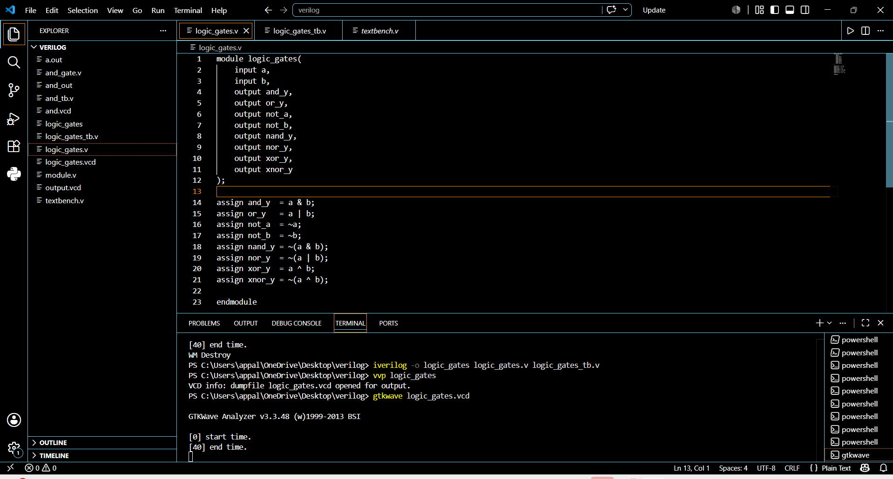
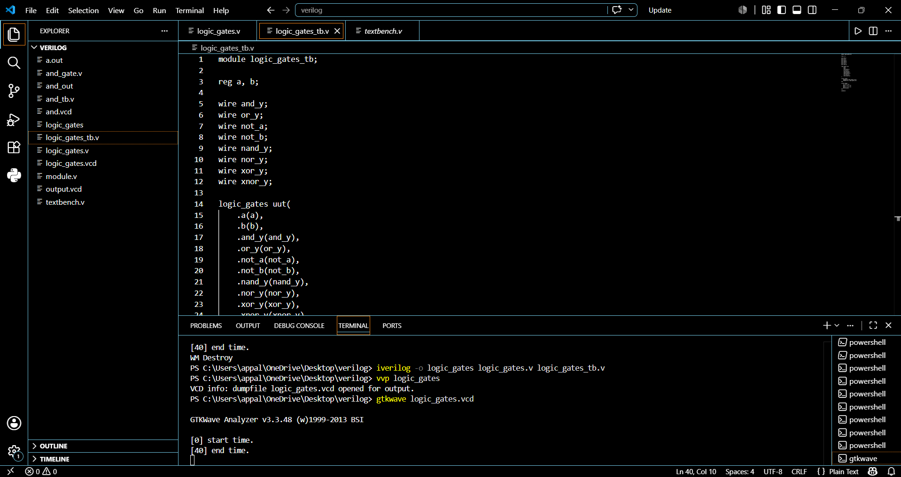

# Logic-Gates-DCD
Verilog Logic Gates:- Implementation and verification of fundamental digital logic gates using Verilog HDL.
⭐Gates: AND, OR, NOT, NAND, NOR, XOR, XNOR

🛠️ Tools Used

💻 VS Code – Writing and editing Verilog HDL code

⚙️ Icarus Verilog – Compiling and simulating Verilog designs

📊 GTKWave – Viewing and analyzing simulation waveforms

CODE:-
# Logic Gates using Verilog HDL

## Gates Implemented
- AND Gate
- OR Gate
- NOT Gate
- NAND Gate
- NOR Gate
- XOR Gate
- XNOR Gate

## Design Methodology
Dataflow Modeling

## RTL Code

## Testbench

## Simulation Waveform

## Tools Used
- VS Code
- Icarus Verilog
- GTKWave

