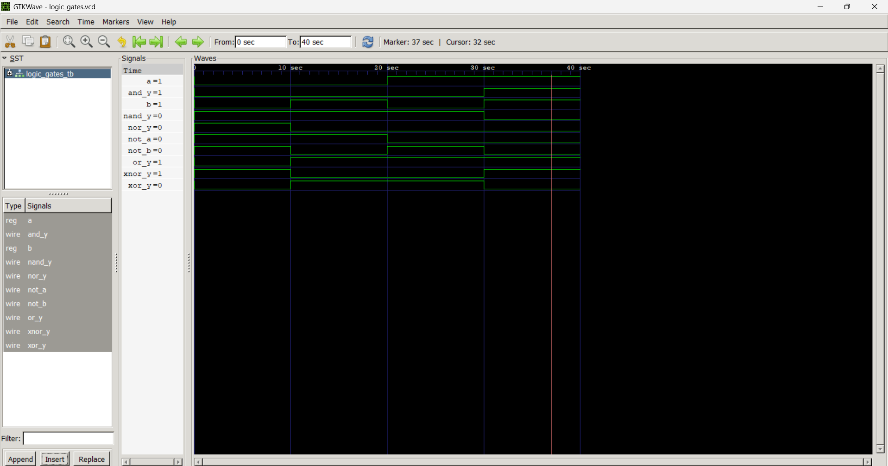

# Logic-Gates-DCD
Verilog Logic Gates:- Implementation and verification of fundamental digital logic gates using Verilog HDL.
⭐Gates: AND, OR, NOT, NAND, NOR, XOR, XNOR

# Logic Gates using Verilog HDL

## Gates Implemented
- AND Gate
- OR Gate
- NOT Gate
- NAND Gate
- NOR Gate
- XOR Gate
- XNOR Gate

## Design Methodology
Dataflow Modeling

## RTL Code

[View RTL Code](logic_gates.v)

## Testbench

[View Testbench](logic_gates_tb.v)

## Simulation Waveform

## Logic Gates Expressions

| Gate | Expression |
|------|------------|
| AND  | A & B |
| OR   | A \| B |
| NOT  | ~A |
| NAND | ~(A & B) |
| NOR  | ~(A \| B) |
| XOR  | A ^ B |
| XNOR | ~(A ^ B) |

## Truth Tables

### AND Gate

| A | B | Y |
|---|---|---|
| 0 | 0 | 0 |
| 0 | 1 | 0 |
| 1 | 0 | 0 |
| 1 | 1 | 1 |

### OR Gate

| A | B | Y |
|---|---|---|
| 0 | 0 | 0 |
| 0 | 1 | 1 |
| 1 | 0 | 1 |
| 1 | 1 | 1 |

### NOT Gate

| A | Y |
|---|---|
| 0 | 1 |
| 1 | 0 |

### NAND Gate

| A | B | Y |
|---|---|---|
| 0 | 0 | 1 |
| 0 | 1 | 1 |
| 1 | 0 | 1 |
| 1 | 1 | 0 |

### NOR Gate

| A | B | Y |
|---|---|---|
| 0 | 0 | 1 |
| 0 | 1 | 0 |
| 1 | 0 | 0 |
| 1 | 1 | 0 |

### XOR Gate

| A | B | Y |
|---|---|---|
| 0 | 0 | 0 |
| 0 | 1 | 1 |
| 1 | 0 | 1 |
| 1 | 1 | 0 |

### XNOR Gate

| A | B | Y |
|---|---|---|
| 0 | 0 | 1 |
| 0 | 1 | 0 |
| 1 | 0 | 0 |
| 1 | 1 | 1 |

## Tools Used
💻 VS Code – Writing and editing Verilog HDL code
⚙️ Icarus Verilog – Compiling and simulating Verilog designs
📊 GTKWave – Viewing and analyzing simulation waveforms
